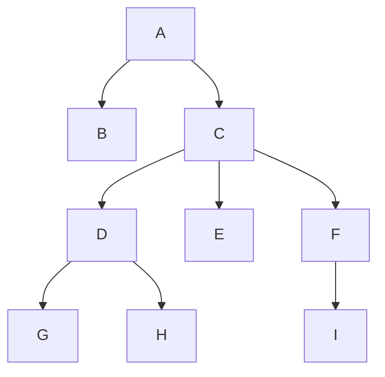

### Árvores

Uma árvore é uma estrutura de dados hierárquica não linear que consistem em nodos conectados por arestas.

Árvore balanceada -> todas as folhas ficam à mesma distância da raiz.

#### Numeração por Níveis

Numeração por níveis indica o nível de cada nodo a partir da raiz.

- A: Nível 0
- B, C: Nível 1
- D, E, F: Nível 2
- G, H, I: Nível 3

### Perguntas

a) Qual a raiz da árvore?  
A raiz da árvore é o nodo **A**.

b) Quantas subárvores esta árvore contém?  
Uma subárvore é qualquer árvore derivada de um nodo. Ao todo, a árvore contém **8 subárvores**.

c) Quais os nodos folha?  
Nodos folha são aqueles que não têm filhos. Os nodos folha são: **B, G, H, E, I**.

d) Qual o grau de cada nodo?  
O grau de um nodo é o número de filhos que ele possui.

- A tem grau 2 (B, C)
- B tem grau 0 (folha)
- C tem grau 3 (D, E, F)
- D tem grau 2 (G, H)
- E tem grau 0 (folha)
- F tem grau 1 (I)
- G tem grau 0 (folha)
- H tem grau 0 (folha)
- I tem grau 0 (folha)

e) Qual o grau da árvore?  
O grau da árvore é o maior grau entre os nodos. O maior grau é **3** (grau de C).

f) Liste os ancestrais de B, G e I.

- Ancestrais de B: **A**
- Ancestrais de G: **A, C, D**
- Ancestrais de I: **A, C, F**

g) Identifique as relações de parentesco entre os nodos.

- **A** é pai de **B** e **C**.
- C é pai de **D**, **E** e **F**.
- D é pai de **G** e **H**.
- **F** é pai de **I**.
- **B**, **E**, **G**, **H** e **I** são filhos únicos (sem irmãos).

h) Liste os nodos de quem C é ancestral direto.  
**C** é ancestral direto de: **D, E, F, G, H, I**.

i) Liste o nodo de que D é descendente direto.  
**D** é descendente direto de **C**.

j) Dê o nível do nodo F.  
O nível de **F** é **2**.

k) Dê o nível do nodo A.  
O nível de **A** é **0**.

l) Qual a altura da árvore?  
A altura da árvore é a distância do nodo raiz até o nodo folha mais distante. A árvore tem altura **3**, pois a maior distância de A até uma folha é 3 (A → C → F → I).

m) Qual o comprimento do caminho entre os nodos A e I?  
O comprimento do caminho entre **A** e **I** é **3** (A → C → F → I).

n) Qual o tamanho da árvore? 
O tamanho da árvore é o número total de nodos. A árvore possui **9 nodos** (A, B, C, D, E, F, G, H, I).