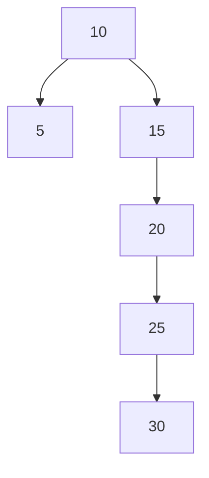
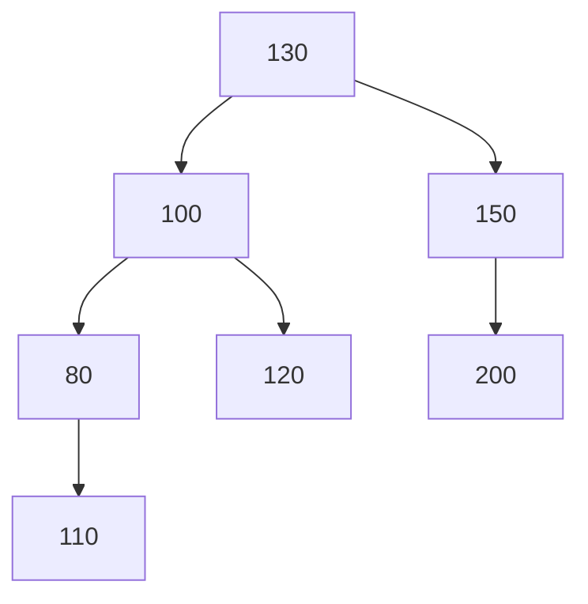
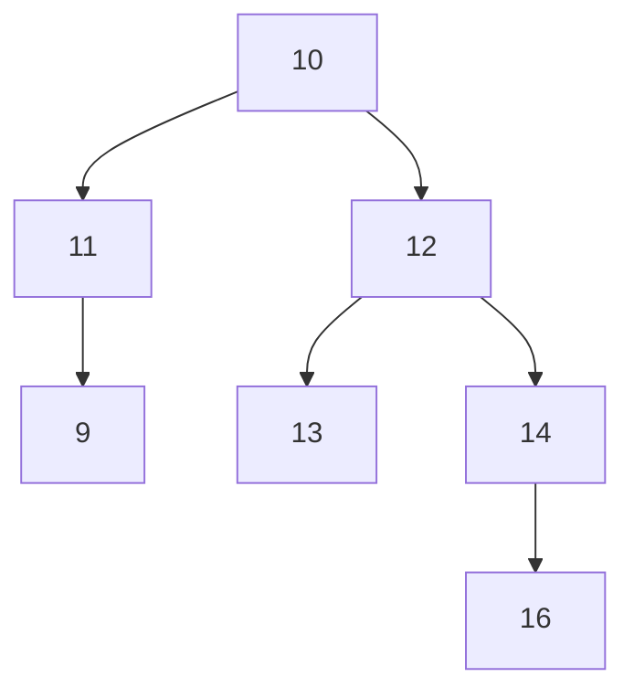
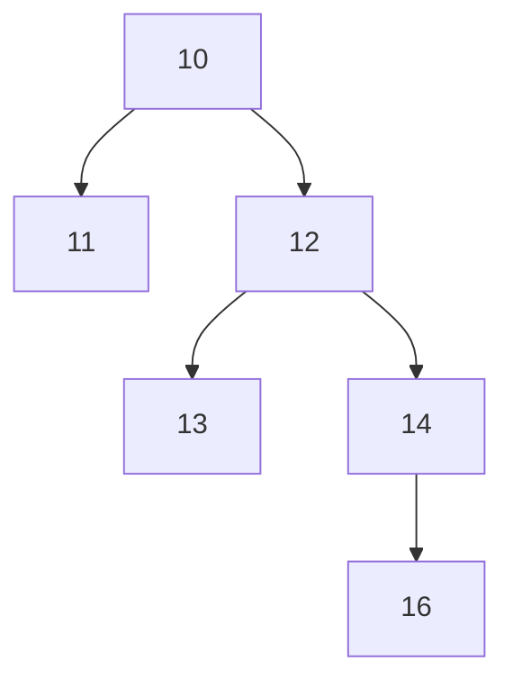
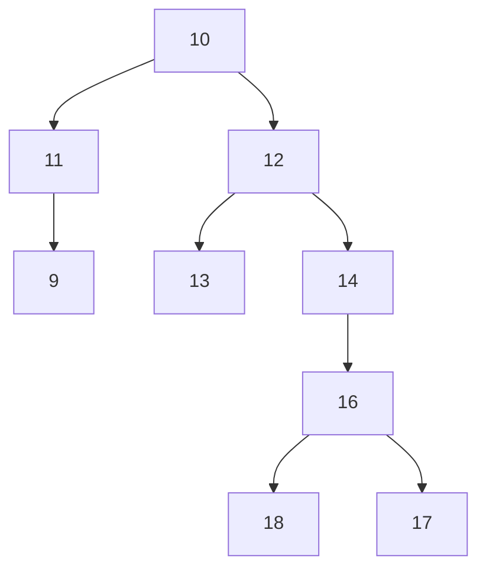

### Distribuição Equilibrada dos Nodos

- Otimizar operações de consulta
- Diminuir número médio de comparações

Exemplo:

10-5-15-20-25-30

### Fator/Grau de Desbalanceamento

FB = Altura subárvore da direita - Altura subárvore da esquerda

### Atividade

1)

a. FB = 0
b. FB = 1
c. FB = 2
d. FB = -1

2)

FB(1): 

FB(2):

FB(3):

3)

